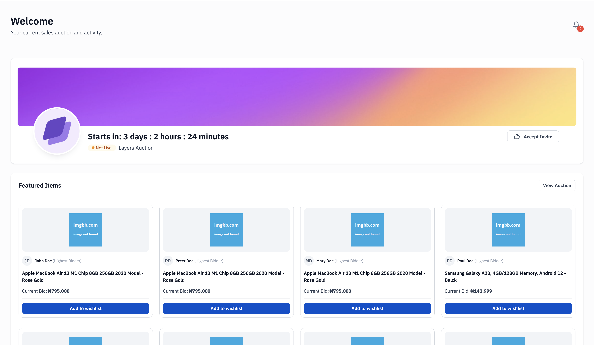

# Rayda

# Rayda Test

This project was bootstrapped with [Create React App]

I used React, Typescript, TailwindCSS, Material UI and RTKQuery

To run this app, follow these steps

#clone the repository
git clone https://github.com/Iroh-Omolola/Rayda.git

# Enter the app folder
cd app

# Install the packages
npm install

# Create a .env file in the root folder and type this:
 REACT_APP_API_URL=https://run.mocky.io/

# Change the "start" in the "script" in package.json folder to this:
 "start": "cross-env REACT_APP_API_URL=https://run.mocky.io/ react-scripts start",

# npm start 

After these, run http://localhost:3000 on your browser

